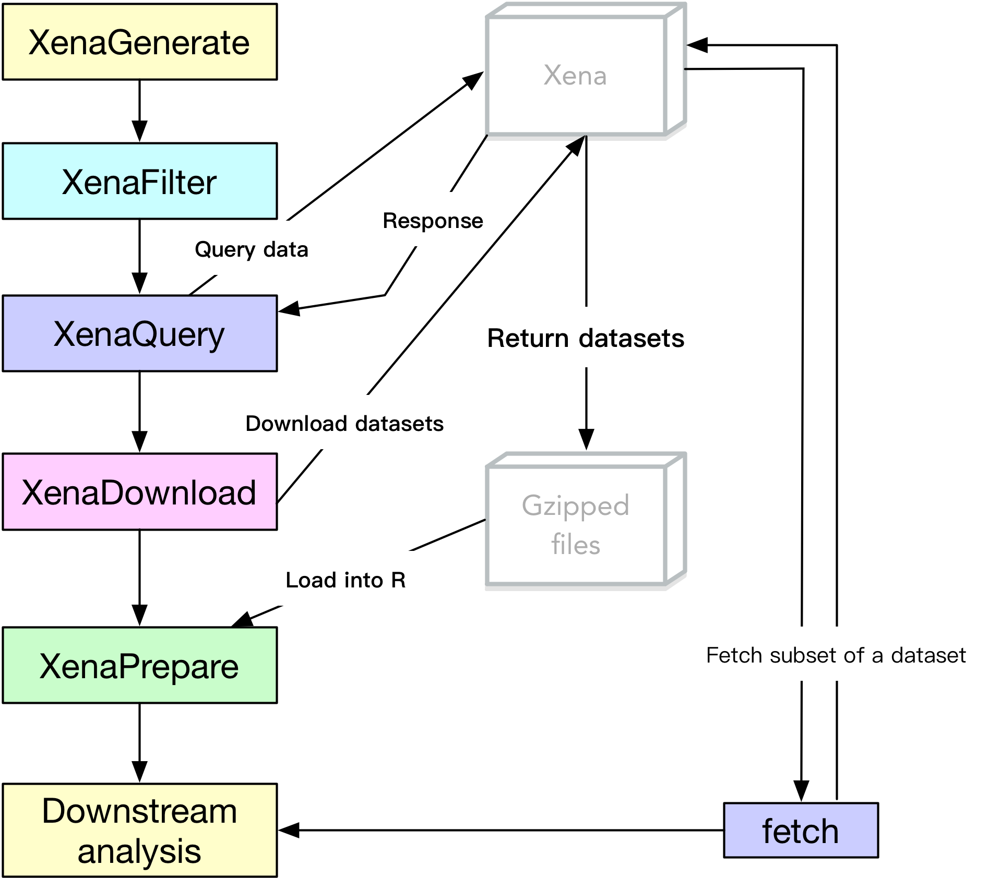

# Summary

UCSC Xena platform (https://xenabrowser.net/) provides unprecedented resource for public omics data [@goldman2019ucsc]
from big projects like The Cancer Genome Atlas (TCGA) [@weinstein2013cancer], 
International Cancer Genome Consortium Data Portal (ICGC) [@zhang2011international],
The Cancer Cell Line Encyclopedia (CCLE) [@barretina2012cancer], or reserach groups like @mullighan2008genomic, @puram2017single.
All available data types include single-nucleotide variants (SNVs), small insertions and deletions (INDELs), large structural variants, copy number variation (CNV), expression, DNA methylation, ATAC-seq signals, and phenotypic annotations. 

Despite UCSC Xena platform itself allows users to explore and analyze data, it is hard
for users to incorporate multiple datasets or data types, integrate the selected data with 
popular analysis tools or homebrewed code, and reproduce analysis procedures.
R language is well established and extensively used standard in statistical and bioinformatics research.
Here, we introduce an R package UCSCXenaTools for enabling data retrieval, analysis integration and 
reproducible research for omics data from UCSC Xena platform.

Currently, UCSCXenaTools supports downloading over 1600 datasets from 10 data hubs of UCSC Xena platform
as shown in Table 1. Downloading UCSC Xena datasets and loading them into R by UCSCXenaTools is a workflow with generate, filter, query, download and prepare 5 steps, which are implemented as functions XenaGenerate, XenaFilter, XenaQuery, XenaDownload and XenaPrepare, respectively. They are very clear and easy to use and combine with other packages like dplyr [@wickham2015dplyr].
Besides, UCSCXenaTools can also query and download subset of a target dataset, 
this is particularly useful when
user focus on studying an object like gene or protein. The key features are summarized in Figure 1.

|Data hub       | Dataset count|URL                                |
|:--------------|-------------:|:----------------------------------|
|tcgaHub        |           879|https://tcga.xenahubs.net          |
|gdcHub         |           449|https://gdc.xenahubs.net           |
|publicHub      |           104|https://ucscpublic.xenahubs.net    |
|pcawgHub       |            53|https://pcawg.xenahubs.net         |
|toilHub        |            50|https://toil.xenahubs.net          |
|singlecellHub  |            45|https://singlecell.xenahubs.net    |
|icgcHub        |            23|https://icgc.xenahubs.net          |
|pancanAtlasHub |            19|https://pancanatlas.xenahubs.net   |
|treehouseHub   |            15|https://xena.treehouse.gi.ucsc.edu |
|atacseqHub     |             9|https://atacseq.xenahubs.net       |

10 data hubs supported by UCSCXenaTools

# Acknowledgements

We thank Christine Stawitz and Carl Ganz for their constructive comments.

# References
